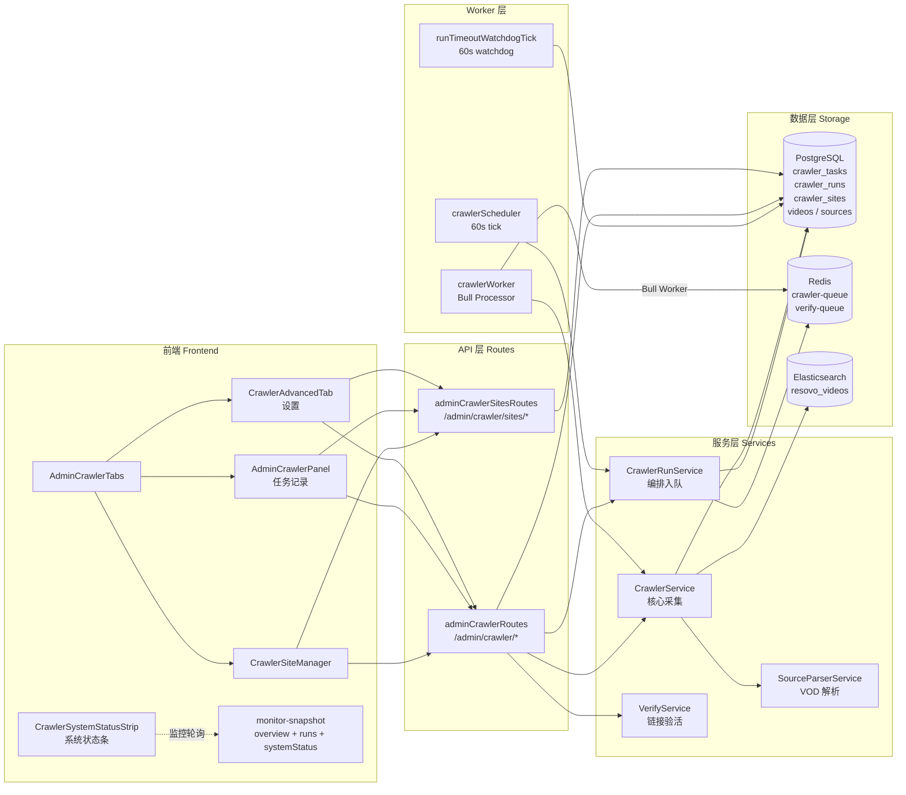
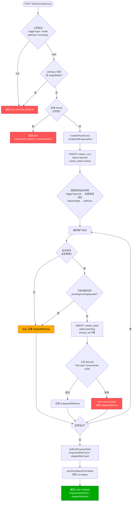
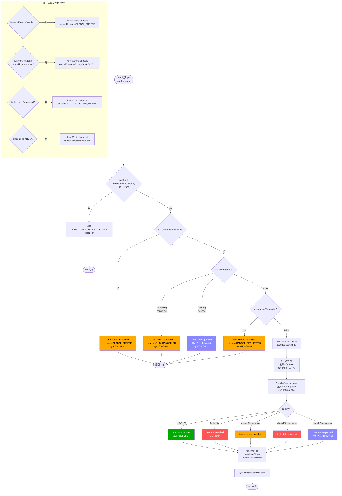
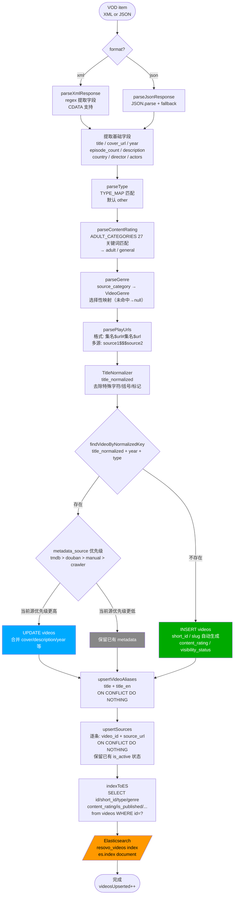
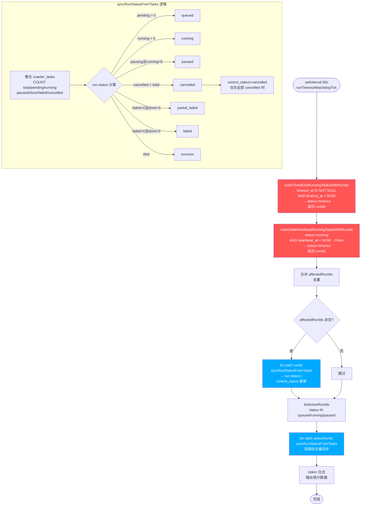
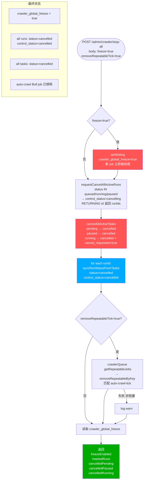

# Resovo 采集系统 — 功能流程图

> status: reference
> owner: @engineering
> scope: crawler functional flow reference
> source_of_truth: no
> supersedes: none
> superseded_by: none
> last_reviewed: 2026-03-27


> 本文档覆盖所有已实现的采集（crawler）功能，每个功能附详细 Mermaid 流程图。
> 源文件索引见文末。最后更新：2026-03-25

---

## 目录

1. [整体系统架构](#1-整体系统架构)
2. [手动触发采集流程](#2-手动触发采集流程)
3. [Worker 任务处理流程](#3-worker-任务处理流程)
4. [核心采集执行流程](#4-核心采集执行流程)
5. [数据解析与入库流程](#5-数据解析与入库流程)
6. [自动调度流程](#6-自动调度流程)
7. [Watchdog 监控流程](#7-watchdog-监控流程)
8. [Run 控制流程（Cancel / Pause / Resume）](#8-run-控制流程)
9. [Stop-All 紧急止血流程](#9-stop-all-紧急止血流程)
10. [站点管理流程](#10-站点管理流程)

---

## 1. 整体系统架构

**说明：** 展示各层组件的职责与连接关系。前端通过 API 层下达指令，RunService 编排任务入队，Worker 异步消费，Scheduler/Watchdog 进行周期性维护。



---

## 2. 手动触发采集流程

**说明：** 管理员通过 `POST /admin/crawler/runs` 手动触发采集批次。支持三种粒度：`single`（单站）、`batch`（多站）、`all`（全部启用站点）。触发后立即返回 runId，实际采集异步进行。



---

## 3. Worker 任务处理流程

**说明：** `crawlerWorker` 从 Bull `crawler-queue` 消费 job，执行采集逻辑。包含多层中止检测机制，确保 cancel/pause/freeze 能在 ≤15 秒内响应。



---

## 4. 核心采集执行流程

**说明：** `CrawlerService.crawl()` 是实际抓取 Apple CMS API 的核心逻辑。`incremental` 只抓第 1 页（当日更新），`full` 分页抓取全量。每个视频独立 upsert，支持随时中断。

```mermaid
flowchart TD
    START([crawl\nsource, options]) --> URL[构建 API URL\nlistingUrl / detailUrl\n?ac=videolist&t=类别&pg=N]

    URL --> PAGE1[fetchPage\nlisting + detail 合并\n第 1 页]
    PAGE1 --> EMPTY1{结果为空?}
    EMPTY1 -->|是| END_EMPTY([采集完成\n0 条记录])
    EMPTY1 -->|否| LOOP[遍历视频条目]

    LOOP --> PARSE[SourceParserService\n.parseVodItem 解析]
    PARSE --> UPSERT[upsertVideo\ntitle_normalized 匹配]
    UPSERT --> ESIDX[indexToES 异步\n失败不中断]
    ESIDX --> PROGRESS[每 2s 更新\ntask.result JSON\n{videosUpserted, errors, pages}]

    PROGRESS --> STOP{shouldStop?}
    STOP -->|cancel| ABORT_C([中止: cancel])
    STOP -->|timeout| ABORT_T([中止: timeout])
    STOP -->|pause| ABORT_P([中止: pause\n等待 requeue])
    STOP -->|false| MORE_ITEMS{同页还有条目?}
    MORE_ITEMS -->|是| LOOP

    MORE_ITEMS -->|否| MODE{采集模式?}
    MODE -->|incremental\n单页即止| DONE([采集完成])
    MODE -->|full\n继续分页| NEXT_PAGE{下一页有数据?}
    NEXT_PAGE -->|否| DONE
    NEXT_PAGE -->|是| FETCH_N[fetchPage\n第 N+1 页]
    FETCH_N --> STOP2{shouldStop?}
    STOP2 -->|非 false| ABORT_C
    STOP2 -->|false| LOOP

    style DONE fill:#0a0,color:#fff
    style ABORT_C fill:#fa0,color:#000
    style ABORT_T fill:#f55,color:#fff
    style ABORT_P fill:#88f,color:#fff
    style END_EMPTY fill:#888,color:#fff
```

---

## 5. 数据解析与入库流程

**说明：** 从 Apple CMS API 响应（XML 或 JSON）解析单个视频条目，映射字段，执行 DB upsert，并推送 ES 索引。整个流程保证幂等性：重复采集不覆盖更优质的 metadata。



---

## 6. 自动调度流程

**说明：** Scheduler tick 每 60 秒执行一次，检查是否到达配置的 `dailyTime`，触发当天的自动采集。防重复触发机制确保每天只触发一次。需要 `CRAWLER_SCHEDULER_ENABLED=true`。

```mermaid
flowchart TD
    START([setInterval 60s\nrunSchedulerTick]) --> FREEZE{crawler_global_freeze\n= true?}
    FREEZE -->|是| SKIP_F([直接返回\n不做任何操作])

    FREEZE -->|否| CONFIG[读取 auto_crawl_config\nglobalEnabled / dailyTime\ndefaultMode / perSiteOverrides]
    CONFIG --> ENABLED{config.globalEnabled?}
    ENABLED -->|false| SKIP_D([直接返回])

    ENABLED -->|true| TIME[获取当前时间\nHH:MM]
    TIME --> MATCH{current == config.dailyTime?}
    MATCH -->|否| SKIP_T([直接返回])

    MATCH -->|是| DEDUP[读取 auto_crawl_last_trigger_date]
    DEDUP --> TODAY{last_trigger_date\n== today?}
    TODAY -->|是 防重触发| SKIP_R([直接返回])

    TODAY -->|否| RUN[CrawlerRunService\n.createAndEnqueueRun\ntriggerType=schedule\nmode=incremental/full\nscheduleId=auto-crawl-daily]
    RUN --> SAVE[setSetting\nauto_crawl_last_trigger_date=today]
    SAVE --> LOG[stderr 日志\n[crawler-scheduler] scheduled run created]
    LOG --> END([完成])

    style SKIP_F fill:#888,color:#fff
    style SKIP_D fill:#888,color:#fff
    style SKIP_T fill:#888,color:#fff
    style SKIP_R fill:#888,color:#fff
    style RUN fill:#0a0,color:#fff
```

---

## 7. Watchdog 监控流程

**说明：** Watchdog tick 与 Scheduler tick 同频（每 60 秒），负责两件事：① 检测并标记超时/心跳停止的任务；② 周期性同步所有活跃 run 的状态，防止监控界面数据滞后。



---

## 8. Run 控制流程

**说明：** 对已创建的采集批次（run）进行三种控制操作。Cancel 立即终止，Pause 挂起等待恢复，Resume 恢复挂起的批次。所有操作都通过 DB 层设置信号，Worker 在下个控制检查周期（≤15s）响应。

```mermaid
flowchart TD
    START([POST /admin/crawler/runs/:id\n/cancel  /pause  /resume]) --> FIND{getRunById}
    FIND -->|not found| ERR[404 Not Found]
    FIND -->|found| OP{操作类型}

    OP -->|cancel| C1[updateRunControlStatus\ncontrol_status=cancelling]
    C1 --> C2[cancelPendingTasksByRun\npending → cancelled]
    C2 --> C3[requestCancelRunningTasksByRun\nrunning tasks cancel_requested=true]
    C3 --> C4[syncRunStatusFromTasks\nstatus → cancelled\ncontrol_status → cancelled]
    C4 --> C_RES[返回 run 最新状态]

    OP -->|pause| P1[updateRunControlStatus\ncontrol_status=pausing]
    P1 --> P2[Worker 检测 pausing\n下次迭代后 requeue+30s]
    P2 --> P3[syncRunStatusFromTasks\nstatus → paused\ncontrol_status → paused]
    P3 --> P_RES[返回 run 最新状态]

    OP -->|resume| R1[updateRunControlStatus\ncontrol_status=active]
    R1 --> R2[Worker 从 queue 取出任务\n检查 active → 正常执行]
    R2 --> R3[syncRunStatusFromTasks\nstatus → running/queued]
    R3 --> R_RES[返回 run 最新状态]

    subgraph Worker 响应（Cancel）
        WC1{controlStatus\n= cancelling?}
        WC1 -->|是| WC2[task status=cancelled\nreason=RUN_CANCELLED\nreturn 结束 job]
    end

    subgraph Worker 响应（Pause）
        WP1{controlStatus\n= pausing/paused?}
        WP1 -->|是| WP2[task status=paused\n重新入队 delay=30s\nreturn 结束 job]
    end

    style C_RES fill:#f55,color:#fff
    style P_RES fill:#88f,color:#fff
    style R_RES fill:#0a0,color:#fff
```

---

## 9. Stop-All 紧急止血流程

**说明：** 全局紧急止血，一次操作中止所有活跃任务和批次。默认同时开启 freeze 防止新任务立即进入，并移除自动采集定时 job。执行后立即同步状态，不依赖 Watchdog（≤60s 延迟）。



---

## 10. 站点管理流程

**说明：** 提供完整的采集源站点（CrawlerSite）生命周期管理，包括 CRUD、批量操作、API 连通验证和单站触发。`from_config=true` 的站点来自配置文件，不允许删除。

```mermaid
flowchart TD
    START([管理员操作]) --> OP{操作类型}

    OP -->|GET /sites| LIST[listCrawlerSites\n支持过滤: key/name/disabled/isAdult\n返回分页列表]

    OP -->|POST /sites| CREATE[upsertCrawlerSite\n先按 api_url 查重\n→ 存在: UPDATE\n→ 不存在: INSERT]
    CREATE --> CREATE_RES[返回新建/更新后的站点]

    OP -->|PATCH /sites/:key| PATCH[updateCrawlerSite\n选择性字段更新\nname/apiUrl/weight/isAdult\ndisabled/ingestPolicy]

    OP -->|DELETE /sites/:key| DEL_CHK{from_config=true?}
    DEL_CHK -->|是| DEL_ERR[403 不允许删除\n配置文件来源站点]
    DEL_CHK -->|否| DEL[deleteCrawlerSite]

    OP -->|POST /sites/batch| BATCH{batchAction}
    BATCH -->|enable| B_EN[disabled=false]
    BATCH -->|disable| B_DIS[disabled=true]
    BATCH -->|delete| B_DEL[逐条检查 from_config\n删除允许项]
    BATCH -->|mark_adult| B_ADU[isAdult=true]
    BATCH -->|unmark_adult| B_UADU[isAdult=false]
    B_EN & B_DIS & B_DEL & B_ADU & B_UADU --> BATCH_RES[返回成功/失败计数]

    OP -->|POST /sites/validate| VAL[fetchText\n站点 apiUrl\n30s timeout\n检测 vod_list 字段]
    VAL --> VAL_OK{HTTP 200\n且含 vod_list?}
    VAL_OK -->|是| VAL_RES[返回 ok=true\nlatencyMs]
    VAL_OK -->|否| VAL_FAIL[返回 ok=false\nerror message]

    OP -->|POST /runs single| TRIG[CrawlerRunService\n.createAndEnqueueRun\ntriggerType=single\nsiteKeys=[key]]
    TRIG --> TRIG_RES[返回 runId / taskId]

    OP -->|POST /sites/import| IMPORT[逐条 upsertCrawlerSite\n批量导入 JSON 格式]

    style CREATE_RES fill:#0a0,color:#fff
    style DEL_ERR fill:#f55,color:#fff
    style BATCH_RES fill:#0a0,color:#fff
    style VAL_RES fill:#0a0,color:#fff
    style VAL_FAIL fill:#f55,color:#fff
    style TRIG_RES fill:#0a0,color:#fff
```

---

## 关键源文件索引

| 文件 | 说明 | 行数 |
|------|------|------|
| `src/api/routes/admin/crawler.ts` | 全部 crawler API endpoints | 642 |
| `src/api/routes/admin/crawlerSites.ts` | 站点 CRUD endpoints | 201 |
| `src/api/workers/crawlerWorker.ts` | Bull job 处理器（processCrawlJob） | 457 |
| `src/api/workers/crawlerScheduler.ts` | 定时调度 + watchdog | 102 |
| `src/api/services/CrawlerRunService.ts` | Run 创建与入队编排 | 155 |
| `src/api/services/CrawlerService.ts` | 核心采集逻辑 + upsert + ES | 477 |
| `src/api/services/SourceParserService.ts` | Apple CMS VOD 解析 | 415 |
| `src/api/db/queries/crawlerTasks.ts` | 任务 DB 操作 | 578 |
| `src/api/db/queries/crawlerRuns.ts` | 批次 DB 操作 + syncRunStatus | 253 |
| `src/api/db/queries/crawlerSites.ts` | 站点 DB 操作 | 261 |
| `src/api/lib/queue.ts` | Bull queue 配置（crawler-queue / verify-queue） | 81 |
| `src/components/admin/AdminCrawlerPanel.tsx` | 任务列表 + 日志查看 UI | 597 |
| `src/components/admin/AdminCrawlerTabs.tsx` | 采集控制台 Tab 导航 | 196 |
| `src/components/admin/system/crawler-site/hooks/useCrawlerMonitor.ts` | 前端监控轮询 hook | 204 |
| `src/components/admin/system/crawler-site/components/CrawlerSystemStatusStrip.tsx` | 系统状态条 UI | 74 |

---

## 状态枚举速查

### crawler_tasks.status
| 值 | 含义 |
|----|------|
| `pending` | 已创建，等待 Worker 消费 |
| `running` | Worker 正在执行 |
| `paused` | 已暂停，等待恢复（已重新入队 delay=30s）|
| `done` | 采集成功完成 |
| `failed` | 采集异常失败 |
| `cancelled` | 被 cancel/stop-all/freeze 中止 |
| `timeout` | 超过 timeout_at 或心跳停止（Watchdog 标记）|

### crawler_runs.status / control_status
| status | 含义 |
|--------|------|
| `queued` | 有 pending tasks，等待执行 |
| `running` | 有 running tasks |
| `paused` | 已暂停 |
| `success` | 全部 done |
| `partial_failed` | 部分 done + 部分 failed |
| `failed` | 全部 failed |
| `cancelled` | 全部 cancelled |

| control_status | 含义 |
|----------------|------|
| `active` | 正常执行中 |
| `pausing` | 暂停信号已发送，等待 Worker 响应 |
| `paused` | 已完全暂停 |
| `cancelling` | 中止信号已发送，等待 Worker 响应 |
| `cancelled` | 已完全中止 |
