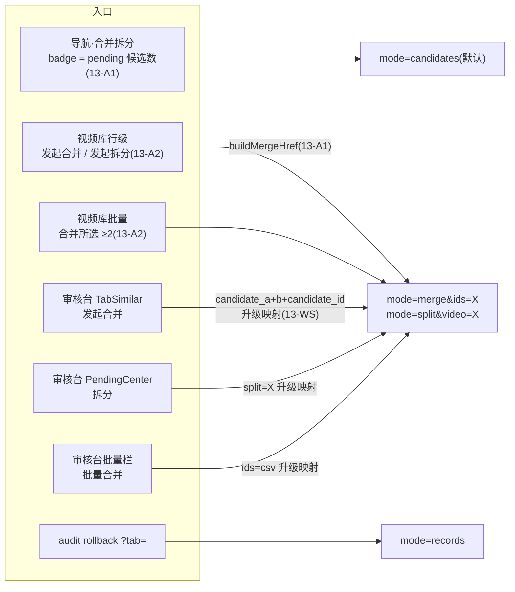
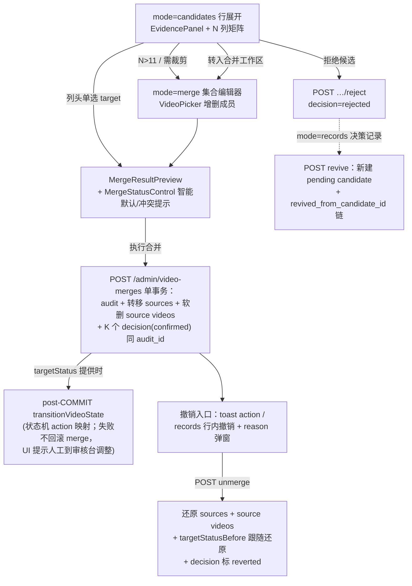
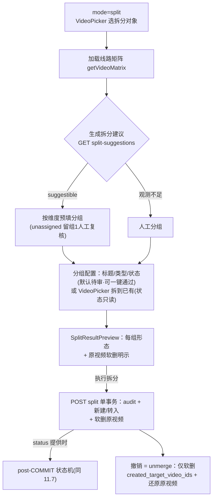
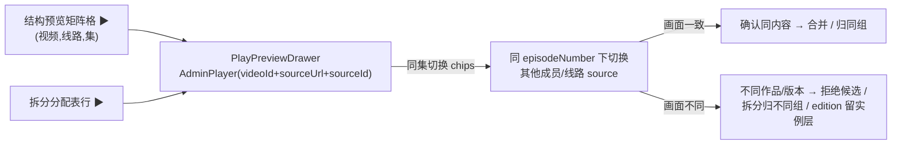

# 后台合并/拆分页面 UI/UX 优化设计（CHG-VIR-13 系列）

> 版本：2026-06-03（2026-06-04 融合修订，见 §10）
> 状态：设计定档 + 融合修订定档，待 CHG-VIR-13-ADR 评审后实施
> 范围：/admin/merge 入口体系、前后对比/预览、合并记录增强、操作内状态设置、工作台 mode 骨架重构（§10 增补）
> 非范围：不改候选评分算法、不启用 auto-bind（D-105a-17 维持 OFF）、不触 catalog-catalog 合并（Phase 5 / CHG-VIR-12-F）、不修改 normalizeTitle / normalizeMergeKey

## 1. 背景

视频身份解析升级（`docs/designs/video-identity-resolution-redesign_20260602.md`）Phase 0–4 已收口：

- identity_candidate / identity_decisions 表落地（migration 086/087）
- 候选默认 identity 来源 + union-find 折叠组（D-105a-18）
- split-suggestions 端点上线（D-105-1~6）
- Phase 5（CHG-VIR-12）schema/迁移/写原语/上卷（12-B~E）已完成，仅 12-F（catalog-catalog 合并脚本）未开始

在此基础上对后台合并/拆分页面做 UI/UX 优化，4 个需求域：

| 域 | 需求 | 现状缺口 |
| --- | --- | --- |
| A 入口规划 | 视频进入合并拆分页面的入口体系 | 导航 badge 硬编码（`admin-nav.tsx:79` `count: 6`）；6 处入口 URL 内联拼接不统一；无来源回链 |
| B 前后预览/对比 | 合并/拆分前对比 + 操作后结果预览 | 候选展开仅简单卡片，无字段级对比、无状态/catalog 信息、无合并/拆分结果预览 |
| C 自动/手动合并记录 | 记录全面增强 + 预留 auto-merge 通道 | audit timeline 不展示标题/reason/来源/decision 关联；identity_decisions 无 UI；reject 后无处查看/复活 |
| D 状态设置 | merge/split 操作内可设置审核/发布/可见状态 | UI 完全不展示 review/visibility 状态；merge 时 source 状态静默丢失；split 新建固定 pending_review/internal 不可设 |

## 2. 已确认产品决策

- 状态设置采用「操作内可设置 + 智能默认」：merge/split 面板展示所有参与 video 当前状态，提供可选状态设置控件（智能默认推导 + 冲突提示）；API 扩展可选字段，不传则维持现行为。
- 合并记录采用「全面增强 + 预留自动通道」：行展开明细 + actor_type（human/system）透出 + identity_decisions 可查（含 rejected 复活入口）；auto-merge 启用（需另起 ADR）后记录通道直接可用。
- 产出形态：本设计文档定档 + CHG-VIR-13 系列任务卡排入 task-queue.md（SEQ-20260604-01），实施走 tasks.md 唯一入口。

## 3. 已验证的代码事实

| 事实 | 证据 | 影响 |
| --- | --- | --- |
| merge snapshot 不含 review/visibility | `video-merge-mutations.ts` `fetchVideosByIds` SELECT 仅 `v.is_published`，无 `v.review_status` / `v.visibility_status` | D 域需扩 SELECT 2 列，unmerge 状态回滚才有依据 |
| 状态变更走 action-keyed 状态机 | `videos.mutations.ts:147` `transitionVideoState` 收 `Pool`、自持 BEGIN/COMMIT + FOR UPDATE；migration 023 DB trigger 强制校验 `(review_status, visibility_status, is_published)` 三元组 | D 域采用 post-COMMIT 跟随式调用，不嵌入 merge 事务 |
| 导航 badge 是静态回退值 | `admin-nav.tsx:79` `count: 6`；`shell-data.tsx` `adminNavCountProviderStub` 返回空 Map；`admin-shell.tsx:173` 已消费 countProvider | A 域只需实接 countProvider（同步函数 + SWR 闭包重建），不改 admin-ui Props |
| candidates 端点已返回 total | `VideoMergesService.ts:200-203` | badge 实时化免新端点 |
| identity_decisions 无列表端点 | `identity-decision.ts` 仅 insert / findConfirmedDecisionsByAuditId / markDecisionReverted | C 域需 2 个新端点（独立 ADR） |
| split 新建 video 状态写死 | `video-merge-mutations.ts` `insertNewVideo` 仅 `is_published=false`（DB 默认 → pending_review/internal） | D 域 split 状态设置同样走 post-COMMIT transition |
| merge 时 target 状态原样保留、source 状态随软删丢失 | `VideoMergesService.ts:295-359` 无状态处理 | 现状基线 |
| audit timeline 已含 username | `GET /admin/video-merges/audit` LEFT JOIN users | C 域行展开复用 |
| DataTable 行展开能力已验证 | MergeCandidatesSection 的 `renderExpandedRow`（CandidateExpand） | C 域 audit 行展开复用同能力，不触 admin-ui Props |

## 4. 四域设计

### 4.1 域 A — 入口体系 + badge 实时化（无 ADR）

**badge 实时化**：

- `apps/server-next/src/lib/shell-data.tsx` 实接 countProvider：client 侧 SWR 轮询（60s）`listCandidates({ source: 'identity', page: 1, limit: 1 })` 读 `total`，数据变化时重建 countProvider 闭包返回 `Map([['/admin/merge', total]])`。
- countProvider 是 admin-ui 既有协议（ADR-103a §4.2），同步函数签名；admin-shell.tsx:173 已消费，runtime 返回值优先于静态 `count: 6` 回退。不改 `packages/admin-ui` 任何 Props。

**入口收口**：

- 新增 `apps/server-next/src/lib/merge/entry.ts`：
  - `MergeEntrySource` 枚举：`videos` / `moderation` / `moderation-batch` / `audit-rollback`
  - `buildMergeHref(params)`：统一构造 `?candidate_a` / `?candidate_b` / `?candidate_id` / `?ids` / `?split` / `?from` / `?tab`
- 替换 4 处内联拼接：`VideoRowActions.tsx:165`、`TabSimilar.tsx:236-238`、`PendingCenter.tsx:148`、`ModerationConsole.tsx:577-579`（rollback-routes.ts 的 `?tab=` 形态也纳入）。

**来源回链**：

- `MergeClient.tsx` 解析 `from` 渲染「来源回链栏」（返回视频库 / 审核台），消除单向深链。

**新增入口（2026-06-04 融合修订 / §10 增强 #3，落 13-A2）**：

- 视频库行级「发起拆分」：`VideoRowActions.tsx` buildItems 与「发起合并」并列（多源/多站点视频是拆分主场景）。
- 视频库批量「合并所选」：`VideoBatchActions.tsx`（DataTable.bulkActions 既有通道，selectedKeys ≥ 2 显示）。
- `MergeEntrySource` 枚举补 `videos-split` / `videos-batch` 两值。

### 4.2 域 B — 字段级对比 + 结果预览（ADR-105 AMENDMENT：response 扩展）

**类型扩展**：`VideoSummaryForMerge`（`packages/types/src/video-merge.types.ts`）扩 6 个 optional 字段：

```ts
readonly reviewStatus?: 'pending_review' | 'approved' | 'rejected'
readonly visibilityStatus?: 'public' | 'internal' | 'hidden'
readonly catalogId?: string
readonly catalogTitle?: string
readonly episodeRange?: { readonly min: number | null; readonly max: number | null }
readonly externalIds?: readonly { readonly provider: string; readonly externalId: string }[]
readonly coverUrl?: string | null   // 2026-06-04 融合修订（§10 增强 #6）：对比矩阵/候选卡 Thumb 缩略图
```

**数据源**：`video-merge-candidates.ts` `fetchVideoDetailsForCandidates` 扩 SELECT（已 JOIN media_catalog，补 `v.review_status` / `v.visibility_status` / mc 标题；外部 ID 取 video_external_refs primary、集数范围聚合 video_sources）。

**新组件**（`apps/server-next/src/app/admin/merge/_client/`）：

- `MergeComparePanel.tsx`：对比矩阵——行 = 字段（title / type / year / catalog / review·visibility 状态 / source 构成 / 集数范围 / 外部 ID），列 = 组内各 video；target 列高亮；冲突字段用 CSS 变量标警（禁硬编码颜色）。
- `MergeResultPreview.tsx`：合并后 target 形态（保留字段 + 转移 source 汇总 + 状态变化预览，结合域 D 智能默认）；拆分每组拆出后的 video 形态（title / type / 拟定状态 / source·集数归属）。

**消费改造**：

- `MergeCandidateExpand.tsx`：嵌入 MergeComparePanel + MergeResultPreview，替换现有纯文本「影响预览」。
- `MergeSplitSection.tsx`：每组下方嵌 MergeResultPreview。
- EvidencePanel（强负 banner / blocking chips / 逐对证据）保持不变；不触 DataTable Props。

**2026-06-04 融合修订增补（§10 增强 #2/#4，落 13-B2A/13-B2B）**：

- 拆分工作台 **VideoPicker ×2**：选拆分对象（替代手输 uuid）+「拆到已有 video」（替代手填 uuid，选中即展示目标视频卡）；复用 `videoPickerFetcher`。
- MergeResultPreview 拆分形态必须**明示原视频去向**：「拆分后原视频软删除（可撤销）」（`VideoMergesService.ts:551` 既有事实，现 UI 零告知）。
- **N→1 矩阵布局策略**（§10.4，落 13-B2A）：列 = 组内各 video 天然横向扩展（identity 折叠组 / legacy 聚合组均为 N-video）；字段名首列 sticky + 列区横向滚动 + 列最小宽度；**target 选择 = 矩阵列头单选**（radio 从卡片迁移到列头，选中列整列高亮，候选路径默认 `recommendedTargetVideoId`），MergeResultPreview 随 target 切换即时重算。

### 4.3 域 C — 记录全面增强 + 决策记录 tab（2 个新端点 → 独立 ADR）

**audit timeline 行展开**（`MergeAuditSection.tsx`）：

- 视频标题：source 标题从 `snapshot_jsonb.videos[].title` 取（已软删视频唯一可靠源；缺失兜底「(已删除视频)」）；target 标题实时 join（target 未删）。
- reason、来源入口、关联 candidate / decision、撤销链（reverted_by / reverted_at / reverted_reason）。
- 行展开复用 DataTable 既有 `renderExpandedRow` 能力。

**auto/manual 列**：透出关联 decision 的 `actor_type`（human / system）。当前恒 human；auto-merge（另起 ADR 后）启用时该列直接可用，无需返工。

**第 4 tab「决策记录」**（新组件 `MergeDecisionsSection.tsx`）：

- 列出 identity_decisions（decision / reverted 过滤 + 分页），rejected 行提供「复活」按钮。
- 独立 tab 理由：decision 是 candidate 维度（confirmed / rejected），与 audit 的 merge / split 操作维度正交；rejected decision 无对应 audit 行，无法挂在 merged / split tab。
- audit timeline 三 tab 保持不变。
- 2026-06-04 融合修订（§10）：13-WS 工作台骨架落地后，audit 时间线与决策记录收纳为 `mode=records` 内的两个子视图；本节组件设计原样复用，仅挂载骨架变化。

**行内撤销（2026-06-04 融合修订 / §10 增强 #5，落 13-C2）**：

- 有效（未撤销）merge/split audit 行直接提供「撤销」按钮 + reason 弹窗（复用 RejectModal 交互范式）。unmerge 端点已有，现状仅 merge 成功 toast 的一次性 action 可达，撤销可达性不足。

**复活协议**：

- revive = 新建 pending candidate + `revived_from_candidate_id` 链（migration 086 已预留；上游设计 §4.3 既定协议：不得覆盖原 rejected 行）。
- 撞 `UNIQUE(canonical_pair_key) WHERE status='pending'` 时幂等返回已有 pending（或 409，CHG-VIR-13-ADR 内定档）。

**新端点**（需独立 ADR + Opus PASS + `verify:endpoint-adr`）：

| 方法 | 路径 | Body/Query | Response | 鉴权 | 审计 |
| --- | --- | --- | --- | --- | --- |
| GET | /admin/identity-decisions | `?decision=confirmed\|rejected&candidateId&reverted=true\|false&limit&page` | `{ data: IdentityDecisionListRow[], total, page, limit }` | adminOnly | 只读，无 |
| POST | /admin/identity-candidates/:id/revive | `{ reason? }` | `{ data: { newCandidateId, revivedFromCandidateId } }` | adminOnly | `identity_candidate.revive` + admin_audit_log（ADR-121） |

**response 扩展**：`MergeAuditRow` 扩 4 个 optional 字段：`actorType` / `relatedCandidateIds` / `relatedDecisionIds` / `videoTitlesSnapshot` → ADR-105 AMENDMENT。

### 4.4 域 D — 状态设置：操作内可设置 + 智能默认（ADR-105 AMENDMENT：body 扩展）

**架构边界（核心决策）**：

状态语义归 ModerationService / `transitionVideoState` 状态机管辖。采用 **post-COMMIT 跟随式**：

- merge/split 事务照常 COMMIT（不在事务内改状态），之后对 target（merge）/ 新建 video（split）调 `transitionVideoState` 映射 action。
- 复用 DB trigger 三元组校验 + 状态机既有审计路径，零事务侵入，不改 `transitionVideoState` 签名。
- **非原子性显式声明**：状态设置失败不回滚 merge/split，UI 提示「合并成功，状态未变更，请在审核台手动调整」。该语义在 ADR AMENDMENT 中定档。

**请求体扩展（全 optional，不传零变更）**：

```ts
// MergeParams 扩展
readonly targetStatus?: {
  readonly reviewStatus?: ReviewStatus
  readonly visibilityStatus?: VisibilityStatus
}
// SplitGroup.newVideoMeta 扩展
readonly status?: {
  readonly reviewStatus?: ReviewStatus
  readonly visibilityStatus?: VisibilityStatus
}
```

后端组合 → action 映射：`approved+public → approve_and_publish`、`approved+internal → approve`、`rejected+hidden → reject`；白名单外组合 422；与当前状态相同时 no-op 跳过调用。拆到已有 target 的组**不接受** status（D-105-5 不动元数据，UI 只读展示）。

**智能默认规则表**（前端纯函数 `apps/server-next/src/lib/merge/status-defaults.ts`，只产状态机白名单内合法组合，可单测）：

| 场景 | 默认建议 | 提示文案 |
| --- | --- | --- |
| target=approved/public，source 均非 public | 保持 target 状态 | 无 |
| target=pending，某 source=approved/public | 建议升 approved（publish 需运营确认） | 「源中有已发布内容，是否同步发布 target？」 |
| target=approved/internal，某 source=public | 建议 approve_and_publish | 「source 的 public 可见性将丢失，建议提升 target」 |
| split 新建 video | pending_review/internal（默认不变） | 「新拆出视频默认待审，可在此直接通过」 |
| split 拆到已有 target | 只读展示（D-105-5） | — |
| 任意含 rejected source | 不自动升级 | 「源含已拒绝内容，请人工复核」 |

**unmerge 状态回滚**：

- merge 时把 target 的 before 状态写入 `snapshot_jsonb.targetStatusBefore`（需 `fetchVidesByIds` SELECT 扩 `review_status` / `visibility_status` 2 列）。
- unmerge 时该字段存在则跟随 transition 还原；存量 audit 无该字段 → 不动（旧行为逐值一致）。
- source 状态本就未动，`restoreVideos`（deleted_at = NULL）即还原，无需额外处理。

**UI**：新组件 `MergeStatusControl.tsx`（状态选择 + 智能默认 + 冲突提示），嵌入 MergeCandidateExpand / BatchMergeWorkspace / MergeSplitSection。

## 5. 端点契约变更清单

**新端点（独立 ADR-NNN，Opus PASS）**：见 §4.3 表格。

**既有端点扩展（ADR-105 AMENDMENT）**：

| 端点 | 变更 | 兼容性 |
| --- | --- | --- |
| GET /admin/video-merges/candidates | response：VideoSummaryForMerge +6 optional 字段 | 不破旧消费方 |
| POST /admin/video-merges | body：`targetStatus?` | 不传维持现行为 |
| POST /admin/videos/:id/split | body：`groups[].newVideoMeta.status?` | 不传 → pending/internal |
| GET /admin/video-merges/audit | response：MergeAuditRow +4 optional 字段 | 不破旧消费方 |

## 6. 任务卡拆分（SEQ-20260604-01）

> ⚠ 2026-06-04 融合修订：本节卡表已被 **§10.3 修订版卡表替代**（新增 13-A2 / 13-WS，13-A→13-A1，13-B2 拆 B2A/B2B，13-C2/13-D2 范围与依赖更新）。本节保留作定档历史，排期以 §10.3 + task-queue.md SEQ-20260604-01 为准。

依赖序：13-ADR →（13-A 并行）→ 13-B1 → 13-B2 / 13-C1 / 13-D1 → 13-D2 / 13-C2 → 13-I18N

| 卡 | 内容（范围 ≤5 项） | 依赖 | 模型 | ADR/migration |
| --- | --- | --- | --- | --- |
| CHG-VIR-13-ADR | ① ADR-105 AMENDMENT（4 端点扩展 + 状态设置 post-COMMIT 边界声明）② 新独立 ADR（identity-decisions list + revive，6 列契约表 + 复活幂等定档）③ verify:endpoint-adr ④ arch-reviewer PASS | 无 | opus | ADR×2，无 migration |
| CHG-VIR-13-A | ① countProvider 实接（SWR 60s）② lib/merge/entry.ts 收口 ③ 4 处入口改 buildMergeHref ④ from 回链栏 | 无（可并行） | sonnet | 无 |
| CHG-VIR-13-B1 | ① VideoSummaryForMerge +6 字段 ② candidates 查询扩 SELECT ③ mapVideoRow 映射 ④ response 透出 | 13-ADR（12-B 已落地，无阻塞） | sonnet | 无 |
| CHG-VIR-13-B2 | ① MergeComparePanel ② MergeResultPreview ③ 嵌入 CandidateExpand ④ 嵌入 SplitSection | 13-B1 | sonnet | 无 |
| CHG-VIR-13-D1 | ① MergeParams/SplitGroup 类型+schema ② fetchVideosByIds 扩 2 列（snapshot targetStatusBefore）③ merge/split post-COMMIT transition + action 映射 + 422 ④ 审计落点 ⑤ unmerge 还原 targetStatusBefore | 13-ADR、13-B1 | opus | 无 |
| CHG-VIR-13-D2 | ① status-defaults.ts 纯函数+单测 ② MergeStatusControl ③ 三处嵌入 | 13-D1、13-B2 | sonnet | 无 |
| CHG-VIR-13-C1 | ① listIdentityDecisions query ② revive Service 方法（幂等+链+审计）③ 2 个新 route ④ AdminAuditActionType 扩枚举 ⑤ IdentityDecisionListRow 类型 | 13-ADR | opus | 无（复用 086/087） |
| CHG-VIR-13-C2 | ① MergeAuditRow 扩展+Service 派生 ② AuditSection 行展开+auto/manual 列 ③ MergeDecisionsSection（第 4 tab+复活）④ MergeClient 加 tab | 13-C1 | sonnet | 无 |
| CHG-VIR-13-I18N | merge 组件硬编码文案抽离至消息文件 | B2/C2/D2 后 | haiku | 无 |

## 7. 关键文件

- `apps/api/src/services/VideoMergesService.ts`：merge/split/unmerge 事务 + 状态设置 post-COMMIT 接入点 + audit 派生
- `apps/api/src/db/queries/video-merge-mutations.ts`：fetchVideosByIds SELECT 扩状态列、snapshot 承载 targetStatusBefore
- `apps/api/src/db/queries/video-merge-candidates.ts`：candidates SELECT 扩展
- `apps/api/src/db/queries/identity-decision.ts`：listIdentityDecisions 新增
- `apps/api/src/db/queries/videos.mutations.ts:147`：transitionVideoState 状态机 action 白名单（D 域映射真源，只读不改）
- `packages/types/src/video-merge.types.ts`：VideoSummaryForMerge / MergeParams / SplitGroup / MergeAuditRow 扩展
- `apps/server-next/src/app/admin/merge/_client/`：MergeClient / MergeCandidateExpand / MergeSplitSection / MergeAuditSection 改造 + 4 个新组件
- `apps/server-next/src/lib/shell-data.tsx`：countProvider 实接
- `apps/server-next/src/lib/merge/`：entry.ts / status-defaults.ts 新增

## 8. 风险与门禁

1. **与 CHG-VIR-12-F 并行**：12-F 是 catalog 层运维脚本（scripts + Service 原语），与 13 系列文件域基本不重叠；12-B~E 已完成，13-B1 无排期阻塞。
2. **admin-ui Props**：全程不触 DataTable / AdminShell Props（countProvider 是已有协议；行展开复用 renderExpandedRow）。若意外需要改 `packages/admin-ui/src/**/types.ts` → 必须 Opus 子代理 + commit trailer（CLAUDE.md 红线）。
3. **状态机非法组合**：前端纯函数只产白名单组合 + 单测覆盖规则表；后端 422 终守门；DB trigger 三元组校验兜底。
4. **post-COMMIT 非原子**：ADR 显式声明语义 + UI 失败提示兜底（「合并成功，状态未变更，请在审核台手动调整」）。
5. **revive 撞 pending 唯一约束**：幂等返回已有 pending（13-ADR 定档，可选 409）。
6. **权限语义**：merge 端点 adminOnly 与审核台一致；状态设置复用 transitionVideoState 不绕过任何校验。
7. **auto-merge 预留不抢跑**：actor_type 列与记录通道仅做展示预留；auto-bind 开关仍按 D-105a-17 另起 ADR，本系列不触碰。

## 9. 验证方式

每卡必跑：

```bash
npm run typecheck
npm run lint
npm run test -- --run
```

- 13-ADR / 13-C1：补跑 `npm run verify:endpoint-adr` + `npm run verify:adr-contracts`
- 13-D1：service test 覆盖「带 targetStatus 生效经状态机校验 / 不传零变更 / 非法组合 422 / unmerge 还原 targetStatusBefore / 存量 audit 兜底」
- 13-D2：status-defaults 规则表单测全覆盖
- 系列收口：merge 页 e2e（候选展开 → 对比 → 设状态 → 执行 → audit 行展开 → 决策 tab 复活），`npm run test:e2e`
- 13-WS 增补验收（2026-06-04 融合修订）：5+1 处旧深链参数升级映射回归（videos 行级 / TabSimilar / PendingCenter split / BatchActionsBar ids / rollback ?tab=）

## 10. 融合修订（2026-06-04）

> 背景：用户要求在**隔离本稿与 SEQ-20260604-01** 的前提下独立产出第二份方案（B 稿，调研与成稿完成于 2026-06-04），再与本稿（A 稿）对比裁定。两稿独立收敛度高（入口收口 + from 来源、badge 硬编码修复、`VideoSummaryForMerge` optional 扩展、对比/预览组件、optional 状态参数、`targetStatusBefore` 还原 + 存量兜底、actor_type 预留、新读端点须 ADR、拆到已有 target 不接受 status），互为验证。本章记录分歧裁定与增强吸收，**与正文冲突处以本章为准**。

### 10.1 分歧裁定（用户 2026-06-04 确认）

| # | 分歧 | A 稿（本稿定档） | B 稿（独立稿） | 裁定 |
| --- | --- | --- | --- | --- |
| 1 | split 新建默认状态 | 默认 pending/internal + 面板一键通过 | 继承原视频三字段 | **A 稿**：内容风控优先（新标题/元数据未复核不应默认公开），面板内顺手确认成本低；§4.4 智能默认规则表第 4 行维持不变 |
| 2 | 改造力度 | 渐进增强（保留单页堆叠 + 第 4 tab） | 重构为工作台（mode 模型、单一活动工作区） | **融合**：A 稿四域设计/状态机边界/端点契约为实施基线，新增 13-WS 工作台重构卡承载骨架改造 |
| 3 | 状态写入机制 | post-COMMIT 跟随调 `transitionVideoState`（显式非原子） | merge 同事务 UPDATE target | **A 稿**：B 稿存在事实盲区——`videos.mutations.ts:147` 状态机自持 BEGIN/COMMIT + FOR UPDATE，migration 023 DB trigger 强制三元组校验；事务内裸 UPDATE 绕过状态机 action 白名单与既有审计路径，违反价值排序 2（边界与复用） |

次级分歧处置：

- **记录组织**：A 稿「audit 3 tab + 决策记录第 4 tab」维度划分成立（decision 维度正交、rejected 无 audit 行）；13-WS 落地后收纳为 `mode=records` 两个子视图，组件设计原样复用。
- **audit 加列**（B 稿提议 `video_merge_audit.actor_type` / `trigger_source` migration）：**放弃**。本稿从关联 decision 透出 `actorType` 已覆盖 human/system 区分且零 migration；auto-merge 启用后也必有 decision，通道一致。`trigger_source` 入口效率分析价值不足以破坏「本系列零 migration」，留待 auto-merge ADR 一并评估。
- **dry-run 预检端点**（B 稿 P2 提议 `GET /admin/video-merges/preview`）：两稿一致本期不做，前端推导覆盖；执行时 409 差异化文案兜底。

### 10.2 B 稿增强吸收（7 项）

| # | 增强项 | 并入 | 理由 |
| --- | --- | --- | --- |
| 1 | **工作台 mode 骨架**：`/admin/merge?mode=<candidates\|merge\|split\|records>` 单一活动工作区，Segment 4 区与 URL 双向同步；DirectMergeWorkspace + BatchMergeWorkspace 合一为 `MergeWorkspace`（视频集合编辑器：VideoPicker 增删成员 + target 单选；2→1 与 N→1 同构）；**旧参数升级映射**（`candidate_a/candidate_b → mode=merge&ids&target`、`split=X → mode=split&video=X`、`ids → mode=merge&ids`、`candidate_id`/`from` 透传）保 5+1 处既有深链不破；MergeClient 拆文件（500 行红线） | **新卡 13-WS** | 用户裁定；消除「深链 banner + 直接合并区 + 批量区 + 拆分区可同时堆叠」 |
| 2 | 拆分工作台 VideoPicker ×2（选拆分对象 + 拆到已有 video，替代两处手输 uuid） | 13-B2B | 盲填错 ID 风险；`videoPickerFetcher` 现成 |
| 3 | 新增入口：视频库行级「发起拆分」+ 视频库批量「合并所选」 | 13-A2（新卡） | 多源视频是拆分主场景；bulkActions 通道现成 |
| 4 | SplitPreview 原视频软删明示（「拆分后原视频软删除（可撤销）」） | 13-B2A | `VideoMergesService.ts:551` 事实，现 UI 零告知 |
| 5 | records 行内撤销按钮 + reason 弹窗（unmerge 端点已有仅 UI 未接） | 13-C2 | 撤销可达性（现仅 toast 一次性 action） |
| 6 | `VideoSummaryForMerge` 增 `coverUrl`（6 → 7 字段），对比矩阵/候选卡 Thumb 缩略图 | 13-B1/13-B2A | 视觉识别效率；复用 admin-ui Thumb |
| 7 | `VideoEditDrawer` 合并/拆分历史区块 + 入口（audit GIN 反查） | **P2 后置，不进 13 系列** | 非关键路径 |

A 稿独有且全部维持的优势项：字段级对比矩阵 MergeComparePanel、rejected 复活 revive 端点 + 协议、audit 行展开标题取 `snapshot_jsonb.videos[].title`、countProvider 实接（免新端点）、智能默认规则表纯函数 + 单测、13-I18N 卡、第 6 处入口（rollback `?tab=`）。

### 10.3 修订版任务卡表（替代 §6；SEQ-20260604-01 同步）

依赖序：13-ADR →（13-A1 并行）→ 13-A2 / 13-WS → 13-B1 → 13-B2A → 13-B2B / 13-PLAY / 13-C1 → 13-C2 / 13-D1 → 13-D2 → 13-I18N。后端卡（13-B1/C1/D1）与 UI 骨架卡（13-WS）可并行，无文件域交叉；13-B2B 与 13-PLAY 同依赖（13-WS + 13-B2A）可并行。

| 卡 | 内容（范围 ≤5 项） | 依赖 | 模型 | 相对 §6 变化 |
| --- | --- | --- | --- | --- |
| CHG-VIR-13-ADR | 不变（ADR-105 AMENDMENT 4 端点扩展 + 新独立 ADR：decisions list + revive） | 无 | opus | 不变 |
| CHG-VIR-13-A1 | ① countProvider 实接（SWR 60s）② entry.ts 收口 ③ 既有 4+1 处入口改 buildMergeHref ④ from 回链栏 | 无（可并行） | sonnet | 原 13-A 更名 |
| CHG-VIR-13-A2 | ① 视频库行级「发起拆分」② 视频库批量「合并所选」③ MergeEntrySource 补 2 枚举 | 13-A1 | sonnet | **新增**（增强 #3） |
| CHG-VIR-13-WS | ① mode 模型 + Segment 4 区 + URL 双向同步 ② 旧参数升级映射 ③ Direct/Batch 合一 MergeWorkspace（VideoPicker 集合编辑）④ MergeClient 拆文件 ⑤ 既有深链回归 e2e | 13-A1 | sonnet | **新增**（增强 #1） |
| CHG-VIR-13-B1 | VideoSummaryForMerge +**7** 字段（原 6 + coverUrl）+ 查询扩 SELECT + mapVideoRow + response | 13-ADR | sonnet | +coverUrl |
| CHG-VIR-13-B2A | ① MergeComparePanel（N 列矩阵：首列 sticky + 横滚 + 列最小宽度 + 列头 target 单选，§10.4）② MergeResultPreview（含拆分组形态 + 原视频软删明示）③ 结构级线路 × 集数预览合成 + 结构信号（互补/冲突/重叠，§10.5；getVideoMatrix ×N 按需拉取） | 13-B1 | sonnet | 原 13-B2 拆出 + 增强 #4 + §10.4/10.5 |
| CHG-VIR-13-B2B | ① 嵌入 CandidateExpand ② 嵌入 SplitWorkspace ③ 拆分 VideoPicker ×2 ④ 候选组「转入合并工作区」+ >11 组引导改转工作区裁剪（§10.4） | 13-B2A、13-WS | sonnet | 原 13-B2 拆出 + 增强 #2 + §10.4 |
| CHG-VIR-13-PLAY | ① PlayPreviewDrawer（AdminPlayer 复用 + 当前格标识）② 同集成员切换 chips ③ 结构预览矩阵格/拆分分配表行点击唤起 ④ 合并/拆分两侧嵌入（§10.5） | 13-WS、13-B2A | sonnet | **新增**（§10.5 播放抽验） |
| CHG-VIR-13-D1 | 不变（post-COMMIT transition + action 映射 + targetStatusBefore + unmerge 还原） | 13-ADR、13-B1 | opus | 不变 |
| CHG-VIR-13-D2 | 不变（status-defaults.ts + MergeStatusControl + 三处嵌入；嵌入点随 13-WS 新骨架） | 13-D1、13-B2B | sonnet | 依赖更新 |
| CHG-VIR-13-C1 | 不变（listIdentityDecisions + revive Service + 2 route + 审计枚举） | 13-ADR | opus | 不变 |
| CHG-VIR-13-C2 | ① MergeAuditRow 扩展 + Service 派生 ② audit 行展开 + auto/manual 列 ③ 决策记录子视图 + revive ④ records mode 集成 ⑤ 行内撤销 + reason 弹窗 | 13-C1、13-WS | sonnet | +增强 #5 + records 集成 |
| CHG-VIR-13-I18N | 不变 | B2B/PLAY/C2/D2 后 | haiku | 依赖更新 |

### 10.4 N→1 合并交互补遗（2026-06-04 第二轮问答定档）

> 现状 N→1 散落三种不一致形态：候选行展开卡片网格（无字段对齐比较）、BatchMergeWorkspace 纯 uuid 行列表（无标题/封面）、DirectMergeWorkspace 仅 2→1 且 target 锁死为 A。融合方案将 N→1 处理为一等公民，本节固化两处实现细节，避免 13-B2A/13-B2B 实施时遗漏。

**1. 矩阵 N 列布局与 target 选择（归 13-B2A）**：

- MergeComparePanel 列 = 组内各 video，N→1 时天然横向扩展；卡片网格在 N>2 时无法字段对齐比较，是矩阵被裁定优于左右对比卡（§10.1 隐含）的原因。
- 布局：字段名首列 sticky，列区横向滚动，列设最小宽度；冲突字段行级标警（CSS 变量）。
- **target 选择 = 矩阵列头单选**：radio 从卡片迁移至列头，选中列整列高亮；候选路径默认 `recommendedTargetVideoId`（推荐 badge 保留），手动路径默认集合首个成员；MergeResultPreview 随 target 切换即时重算（源数总和 / 站点并集 / 状态），其余 N-1 列置灰标「将软删除」。
- 两条路径（候选行展开 / MergeWorkspace）复用同一组件；2→1 即 N=2 特例，无独立 UI 形态（消除 DirectMergeWorkspace「target 锁死为 A」限制）。

**2. 候选组「转入合并工作区」+ 超限分批（归 13-B2B，依赖 13-WS）**：

- 候选行展开新增次级动作「转入合并工作区」：组成员 ids 带入 `mode=merge` 集合编辑器，可经 VideoPicker 继续增删成员后执行。
- **N > 11 组**（MergeSchema source ≤ 10 + target 上限）：现状「禁用整组合并 + 提示逐对明细分批」升级为**引导转入工作区裁剪集合分批合并**；EvidencePanel 逐 pair 拒绝仍保留。
- 深链语义不变：`?ids=csv` / `?candidate_a=X` 仅预填集合（经 13-WS 升级映射），进入后均可继续编辑成员。

### 10.5 结构级结果预览 + 播放抽验（2026-06-04 第三轮问答定档）

> 缺口：① MergeResultPreview / SplitResultPreview 原设计仅有汇总数字（源数总和/站点并集/状态），缺「合并/拆分后这个视频长什么样」的**结构级预览**（线路 × 集数）；② 人工判断是否同一作品的根本手段是**播放看内容**，合并/拆分页面完全没有播放能力（现状只能跳前台详情页或回审核台）。两项均零新端点落地。

**1. 结构级结果预览（归 13-B2A，扩 MergeResultPreview / SplitResultPreview）**：

- **合并后线路 × 集数预览**：对集合内 N 个视频各调既有 `getVideoMatrix`（`GET /admin/sources/video-groups/:id/matrix` → `LineMatrixRow[]`）前端合成「合并后 target 的线路矩阵」：行 = 线路（标注来源视频徽标），格 = 集数覆盖。
- **结构信号**（前端推导）：
  - 集数互补（E1–E8 + E9–E12）→ 正信号「集数互补，疑似同作品分段收录」；
  - 同站同名线路重复 → danger 预警「执行将触发跨站源冲突（409）」（merge 预检 SQL 的前端前置）；
  - 集数完全重叠 → info「集数完全重叠，请播放抽验确认是否同内容（可能为版本/语言差异）」。
- **加载策略**：候选行展开内默认仅汇总，提供「展开线路集数预览」按钮按需拉取（N ≤ 11 次并行请求，避免行展开变重）；`mode=merge` 工作区成员确定后自动拉取。
- **拆分侧**：SplitResultPreview 每组卡内嵌该组分到的线路 × 集数明细（分配表数据纯前端推导，零请求）+ 组间集数覆盖/缺口提示。

**2. 播放抽验（新卡 13-PLAY）**：

- **核心交互 = 同集对比切换**：判断「是否同一作品/版本」靠同一集画面对比。结构预览矩阵 / 拆分分配表中任一（视频, 线路, 集）格可点击 → 播放抽屉加载该 source；抽屉顶部提供**同集数下成员快速切换 chips**（A/B/C/D 同集秒切对比画面）。
- **组件复用**：`AdminPlayer`（`moderation/_client/AdminPlayer.tsx`，props 自足 `{ videoId, sourceUrl, sourceId, title? }`，独立 admin 播放器不接 GlobalPlayerHost；跨模块导入有 VideoEditDrawer 先例，若第 3 消费方出现再上提共享层）；`EpisodeCell` 已含 `sourceId / episodeNumber / sourceUrl`，点击格即可直接喂给 AdminPlayer，**零播放器开发**。
- **形态**：右侧播放抽屉（`PlayPreviewDrawer`），可关闭、记忆最近播放格；内含 AdminPlayer + 当前（视频/线路/集）标识 + 同集成员切换 chips。合并（候选行展开 + mode=merge）与拆分（分配表行）两侧均可唤起。
- **边界**：不触 player-core / shell 公共 API（仅消费 AdminPlayer 既有封装，不触发 Opus 强制项）；播放 feedback 上报沿用 AdminPlayer 内建逻辑不另加。
- **任务卡**：13-PLAY 依赖 13-WS + 13-B2A，与 13-B2B 并行；涉及播放器消费 → 完成后补跑 `npm run test:e2e`（PLAYER 类）。

## 11. 目标布局与工作流程图（2026-06-04）

> 实施参考稿：13-WS / 13-B2A / 13-B2B / 13-C2 / 13-D2 的 UI 落地以本节线框为基准；与 §4 / §10 文字描述冲突处以文字定档为准，线框仅固化空间关系与交互锚点。

### 11.1 整体骨架（13-WS mode 模型）

```text
┌────────────────────────────────────────────────────────────────────────┐
│ PageHeader  合并 / 拆分工作台                                            │
├────────────────────────────────────────────────────────────────────────┤
│ ◂ 来源回链栏（仅深链进入时渲染，13-A1）                                   │
│   「来自审核台 · 视频 89ab12cd」                      [返回审核台] [×]   │
├────────────────────────────────────────────────────────────────────────┤
│ Segment：[ 待审候选 ] [ 合并工作区 ] [ 拆分工作区 ] [ 操作记录 ]          │
│           mode=candidates  mode=merge   mode=split    mode=records      │
│           （URL ?mode= 双向同步；同一时刻仅一个活动工作区，旧的            │
│            深链 banner + 直接合并区 + 批量区 + 拆分区堆叠形态废除）        │
├────────────────────────────────────────────────────────────────────────┤
│                                                                          │
│                        ░░ 活动工作区（见 11.2–11.5）░░                   │
│                                                                          │
└────────────────────────────────────────────────────────────────────────┘
```

### 11.2 mode=candidates 待审候选（13-B2A/B2B/D2 嵌入后）

```text
┌─ 工具栏 ────────────────────────────────────────────────────────────────┐
│ 候选来源 [实时聚合 | 多证据●]  （legacy 时：minScore [0.6] [应用]）        │
│ （identity 空表降级提示条）                                共 N 对候选 ─┤
├─ DataTable（一体化）────────────────────────────────────────────────────┤
│  作品                     │ 候选数 │ 重合度 │                            │
│  ▸ 某作品 2023 · movie    │ 3 条   │ 87.5%  │                            │
│  ▾ 某剧   2024 · series   │ 4 条   │ 92.1%  │ ← 行展开                   │
│  ┌─ 展开面板 ─────────────────────────────────────────────────────────┐ │
│  │ [87.5% 置信度] [身份分 91.2%]   4 个候选视频                         │ │
│  │ ── EvidencePanel（保持不变）───────────────────────────────────────│ │
│  │ 为何拦截：…（强负 banner）│ 为何可合并：[chip][chip] │ 逐对明细 ▸    │ │
│  │ ── MergeComparePanel（N 列字段矩阵 / §10.4）───────────────────────│ │
│  │ ┌────────┬─────────────┬───────────┬───────────┬───────────┐       │ │
│  │ │ 字段    │ ◉ video A   │ ○ video B │ ○ video C │ ○ video D │ →横滚 │ │
│  │ │(sticky)│   ★推荐      │           │           │           │       │ │
│  │ ├────────┼─────────────┼───────────┼───────────┼───────────┤       │ │
│  │ │ 封面    │ [Thumb]     │ [Thumb]   │ [Thumb]   │ [Thumb]   │       │ │
│  │ │ 标题    │ 某剧 S1     │ 某剧      │ 某剧 第一季│ 某剧(粤)  │       │ │
│  │ │ 类型/年 │ series 2024 │ series 24 │⚠series 23 │ series 24 │←冲突警│ │
│  │ │ catalog│ mc:某剧     │ mc:某剧   │ mc:某剧   │ mc:某剧   │       │ │
│  │ │ 状态    │ 已审·公开   │ 待审·内部 │ 已审·公开 │ 待审·内部 │←VisChip│ │
│  │ │ 源构成  │ 3源·2站     │ 1源·1站   │ 2源·2站   │ 1源·1站   │       │ │
│  │ │ 集数    │ E1–E12      │ E1–E12    │ E1–E8     │ E9–E12    │       │ │
│  │ │ 外部ID  │ db:123      │ db:123    │ —         │⚠bgm:456   │       │ │
│  │ └────────┴─────────────┴───────────┴───────────┴───────────┘       │ │
│  │  （列头 radio = target 单选，选中列整列高亮；N>11 → 整组合并禁用      │ │
│  │    + 引导「转入合并工作区裁剪分批」）                                  │ │
│  │ ── MergeResultPreview ────────────────────────────────────────────│ │
│  │ After：◉ A「某剧 S1」→ 7源·3站 · 状态：已审·公开                     │ │
│  │        B / C / D 置灰 ·「将软删除（可撤销）」                         │ │
│  │ ⚠ source C 为已审·公开，合并后该内容默认不可见                        │ │
│  │ [▾ 展开线路集数预览]（按需拉 getVideoMatrix ×N，§10.5）              │ │
│  │ ┌─ 合并后线路 × 集数（来源徽标 + 格可点播放）────────────────────┐  │ │
│  │ │ 站A·线路1 [来自A] │ ▶E1 ▶E2 … ▶E12        ← 互补 ✓            │  │ │
│  │ │ 站B·线路1 [来自C] │ ▶E1 … ▶E8                                 │  │ │
│  │ │ 站B·线路1 [来自D] │ ▶E9 … ▶E12   ⚠同站同名线路重复→执行将409   │  │ │
│  │ │ 站C·线路2 [来自B] │ ▶E1 … ▶E12   ⓘ集数完全重叠→建议播放抽验    │  │ │
│  │ └────────────────────────────────────────────────────────────────┘  │ │
│  │ ── MergeStatusControl（13-D2 智能默认）───────────────────────────│ │
│  │ 合并后 target 状态：[保持现状 ▾]（含冲突提示快捷项）                  │ │
│  │                                                                    │ │
│  │            [拒绝候选] [转入合并工作区]      [执行合并（3 → A）]       │ │
│  └────────────────────────────────────────────────────────────────────┘ │
│  分页 …                                                                 │
└──────────────────────────────────────────────────────────────────────────┘
```

### 11.3 mode=merge 合并工作区（13-WS：Direct/Batch 合一）

```text
┌─ 集合编辑器 ────────────────────────────────────────────────────────────┐
│ [VideoPicker：搜索添加视频…]                  成员 4 / 上限 11           │
│ ┌──────────────────────────────────────────────────────────────────┐   │
│ │ ◉ 某剧 S1   已审·公开  3源·2站   ★target                  [移除]  │   │
│ │ ○ 某剧      待审·内部  1源·1站                            [移除]  │   │
│ │ ○ 某剧第一季 已审·公开  2源·2站                            [移除]  │   │
│ │ ○ 某剧(粤)  待审·内部  1源·1站                            [移除]  │   │
│ └──────────────────────────────────────────────────────────────────┘   │
│ （深链 ?ids=csv / 旧 ?candidate_a/b 经升级映射仅预填集合，进入后可增删；  │
│   candidate_id 锚点在成员集合仍与候选 pair 一致时透传 confirm）           │
├─ MergeComparePanel（与 11.2 同一组件复用）──────────────────────────────┤
├─ MergeResultPreview（成员确定后自动拉结构预览，§10.5）+ StatusControl ──┤
│ 合并原因：[__________________________________（≤500）]                  │
│                                          [执行合并（N-1 → target）]     │
└──────────────────────────────────────────────────────────────────────────┘
（结构预览任一 ▶ 格点击 → 右侧 PlayPreviewDrawer 播放抽验，见 11.9）
```

### 11.4 mode=split 拆分工作区（13-B2B VideoPicker + 13-D2 状态 + §10.4）

```text
┌─ 拆分对象 ──────────────────────────────────────────────────────────────┐
│ [VideoPicker：选择要拆分的视频…]                                          │
│ → 已选：「某剧合集」 已审·公开 · 8源·3站 · E1–E24       [生成拆分建议]    │
├─ 建议信号区（suggestible 时）───────────────────────────────────────────┤
│ 建议维度：季 │ · 多个季号：S1 / S2 │ · 外部 ID 冲突（douban / bangumi）   │
├─ 分组配置 ──────────────────────────────────────────────────────────────┤
│ ┌─ 组 1（新建）───────────────┐  ┌─ 组 2（转入已有）──────────────────┐  │
│ │ 标题：[某剧 第一季      ]    │  │ [VideoPicker：拆到已有视频…]        │  │
│ │ 类型：[剧集 ▾]              │  │ → 目标卡：「某剧 S2」已审·公开·2源  │  │
│ │ 状态：[待审·内部 ▾]         │  │   （状态只读 · 不改其元数据，       │  │
│ │ （默认待审，可在此一键通过： │  │     D-105-5）                      │  │
│ │   §4.4 智能默认规则表）      │  │                                    │  │
│ └─────────────────────────────┘  └────────────────────────────────────┘  │
├─ 线路矩阵分配表（行可点 ▶ 播放抽验，§10.5 / 11.9）──────────────────────┤
│ 线路        │ 集  │ URL          │ 分配到    │                           │
│ 站A·线路1   │ E1  │ http://…     │ [组 1 ▾]  │ ▶                         │
│ 站B·线路2   │ E13 │ http://…     │ [组 2 ▾]  │ ▶                         │
├─ SplitResultPreview（§10.2 增强 #4 + §10.5 组内明细）───────────────────┤
│ ┌─ 组1 卡 ─────────────────────────┐ ┌─ 组2 卡 ───────────────────────┐ │
│ │ 某剧 第一季·剧集·待审·内部·5源    │ │ +3源 → 已有视频「某剧 S2」      │ │
│ │ └ 站A·线路1 E1–E8 / 站C E1–E4    │ │ └ 站B·线路2 E13–E24            │ │
│ └──────────────────────────────────┘ └────────────────────────────────┘ │
│ ⓘ 组间集数覆盖：组1 E1–E8 · 组2 E13–E24（E9–E12 原视频无源，非分配遗漏）│
│ ⚠ 原视频「某剧合集」拆分后将软删除（可撤销）                              │
│                                                  [执行拆分（2 组）]      │
└──────────────────────────────────────────────────────────────────────────┘
```

### 11.5 mode=records 操作记录（13-C2）

```text
┌─ 子视图 ────────────────────────────────────────────────────────────────┐
│ [ 操作时间线 ● ] [ 决策记录 ]                                             │
├─ 操作时间线（audit）────────────────────────────────────────────────────┤
│ 筛选：[全部|合并|拆分] [人工|自动] [有效|已撤销]   videoId：[________]    │
│ ▸ 合并 │ admin1 │ 3 → 1 │ 人工 │ 2026-06-04 12:00 │ 有效   │ [撤销]     │
│ ▾ 拆分 │ admin2 │ 1 → 2 │ 人工 │ 2026-06-03 18:30 │ 已撤销 │            │
│   └ 展开：涉及视频（标题取 snapshot_jsonb.videos[].title，缺失兜底        │
│      「(已删除视频)」；target 实时 join）· reason · 关联 candidate /      │
│      decision · 撤销链（reverted_by / at / reason）· targetStatusBefore  │
├─ 决策记录（identity_decisions）─────────────────────────────────────────┤
│ 筛选：[confirmed|rejected] [含已撤销]                                    │
│ rejected  │ pair 89ab12cd ↔ 34ef56gh │ 合并工作台人工拒绝 │ … │ [复活]   │
│ confirmed │ pair …（关联 audit →）   │ …                 │ … │          │
└──────────────────────────────────────────────────────────────────────────┘
（行内撤销点击 → reason 弹窗（RejectModal 范式）→ POST unmerge；
 复活点击 → POST revive → 新建 pending candidate + revived_from 链）
```

### 11.6 入口与深链升级映射流程



### 11.7 合并工作流（含状态设置与撤销/复活）



### 11.8 拆分工作流



### 11.9 播放抽验 PlayPreviewDrawer（13-PLAY / §10.5）

```text
工作区（11.2/11.3/11.4 任一 ▶ 格/行点击）          ┌─ PlayPreviewDrawer ─────────┐
┌──────────────────────────────┐                  │ 播放抽验            [×]      │
│ …合并后线路 × 集数预览…       │   点击 ▶E3       │ ┌─────────────────────────┐ │
│ 站A·线路1 [来自A] ▶E1 ▶E2 ▶E3─┼─────────────────▶│ │                         │ │
│ 站B·线路1 [来自C] ▶E1 ▶E2 ▶E3 │                  │ │   AdminPlayer (16:9)    │ │
│ …                            │                  │ │   播放/暂停/进度/重试    │ │
└──────────────────────────────┘                  │ └─────────────────────────┘ │
                                                   │ 正在播放：video A · 站A·    │
  核心交互 = 同集对比切换：                          │ 线路1 · E3                  │
  同一集数（E3）下秒切 A/B/C/D                      │ ── 同集切换（E3）──────────│
  对比画面是否同一内容                              │ [◉A 站A·线1] [○C 站B·线1]  │
                                                   │ [○D 站B·线1] [○B 站C·线2]  │
                                                   │ ── 集数 ───────────────────│
                                                   │ [E1][E2][E3●][E4]…          │
                                                   └─────────────────────────────┘
```


